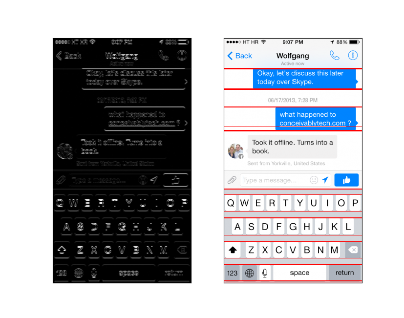

# Screenshot detector
---
## Introduction
Inspired by the layout analysis from the phone screen, we built a screenshot detection tool based on the detection of horizontal edges.

The detection steps are as follows:

The original image.


Load and convert to gray image.


Detect horizontal edge



Count the number of horizontal edges to decide if it's a screenshot or not. In general, we choose the number of edges greater than or equal to 1.

## Installation
In the current version, the tool only works with python3.

Build and install from source:
```
$ git clone https://github.com/dukn/screenshot_detector.git
$ cd screenshot_detector
$ pip install . # pip3
```
## Usage
To use as a python library:
```
from screenshot_detector import detect
```

The tool reads image from the disk path or link and detects horizontal edges.

The parameters of `detect` function:
  + list_image: list of tuple (index, image_path, type)
                  - index is index of the image.
                  - image_path is path or url to the image we need to process.
                  - type is type of image_path. The type must be "link" or "path".
  Example: `list_image = [(1, 'path_to_image.jpg', 'path'),
  (2, 'https://website.com/url_to_image.jpg', 'link')]`.

  + nprocess: int, default = 40
                  Number of the processors.

  + output: str, default = "output.tsv"
                  Path to output file, defaul is output.tsv.
                  The output file with 3 columns and seperate by a tab ('\t').
                  The first column is index.
                  The second column is image_path.
                  The third column is number of horizontal line in this image.


## Tests
Detect:
```
from screenshot_detector import detect
input = [(1, 'images/test/img1.jpg', 'path'), (2, 'images/test/img2.png', 'path')]
detect(list_image=input, nprocess=4, output="output_path.tsv")
```
